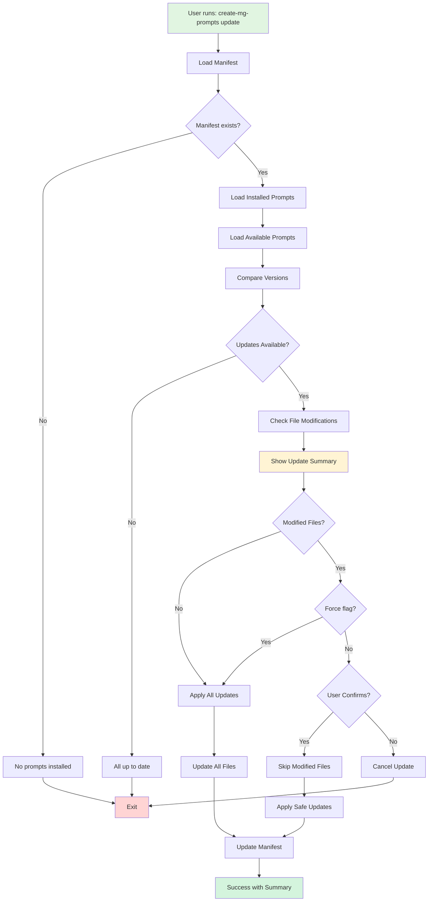

# create-mg-prompts Architecture

## Overview

`create-mg-prompts` is a TypeScript CLI tool designed to manage AI prompts for Claude Code and other AI assistants. It follows a modular architecture with clear separation of concerns.

## Project Structure

```
create-mg-prompts/
├── src/
│   ├── index.ts           # CLI entry point and command definitions
│   ├── types.ts           # TypeScript interfaces and types
│   ├── commands/          # Command implementations
│   │   ├── init.ts        # Initialize/install prompts
│   │   ├── list.ts        # List available/installed prompts
│   │   └── update.ts      # Update installed prompts
│   └── utils/             # Utility functions
│       ├── package.ts     # Package.json utilities
│       ├── paths.ts       # Path detection and management
│       ├── prompts.ts     # Prompt loading and parsing
│       ├── project.ts     # Project root detection
│       ├── manifest.ts    # Version tracking manifest
│       └── claude-md.ts   # CLAUDE.md file management
├── dist/                  # Built output
│   ├── index.js          # Compiled CLI
│   └── prompts/          # Bundled prompt files
└── docs/                 # Documentation
```

## Key Components

### 1. CLI Entry Point (`src/index.ts`)

- Uses Commander.js for CLI argument parsing
- Defines available commands: `init`, `list`, `update`
- Default action runs `init` for better UX
- Handles global flags like `--version` and `--help`

### 2. Command Implementations

#### `init` Command (`commands/init.ts`)
- **Purpose**: Install prompts to a project or globally
- **Flow**:
  1. Detect installation mode (local vs global)
  2. Find project root or Claude Code config path
  3. Load available prompts with metadata
  4. Interactive selection (or install all with `-y`)
  5. Check for conflicts and handle overwrites
  6. Copy prompt files to destination
  7. Update manifest with version tracking
  8. Update CLAUDE.md with prompt references

#### `list` Command (`commands/list.ts`)
- **Purpose**: Show available or installed prompts
- **Modes**:
  - Default: List all available prompts from bundle
  - `--installed`: Show prompts in current project

#### `update` Command (`commands/update.ts`)
- **Purpose**: Update installed prompts to latest versions
- **Features**:
  - Detects local modifications
  - Warns before overwriting changes
  - `--force` flag to override safety checks

### 3. Utility Modules

#### Path Detection (`utils/paths.ts`)
- Detects Claude Code installation across platforms:
  - macOS: `~/Library/Application Support/Claude`
  - Windows: `%APPDATA%/Claude`
  - Linux: `$XDG_CONFIG_HOME/claude`
- Provides default paths for prompts and manifest

#### Project Detection (`utils/project.ts`)
- Finds project root by looking for indicators:
  - `package.json`, `CLAUDE.md`, `.git`
  - Language-specific files (`pyproject.toml`, `Cargo.toml`, etc.)
- Walks up directory tree until found

#### Prompt Management (`utils/prompts.ts`)
- Loads prompts from bundled `dist/prompts/`
- Parses frontmatter using `gray-matter`
- Provides prompt content retrieval

#### Version Tracking (`utils/manifest.ts`)
- Manifest schema:
  ```json
  {
    "version": "1.0.0",
    "prompts": [{
      "id": "max",
      "version": "1.0.0",
      "installedAt": "2025-06-05T21:17:40.492Z",
      "modified": false
    }]
  }
  ```
- Tracks installed versions and modification status
- Enables safe updates with change detection

#### CLAUDE.md Integration (`utils/claude-md.ts`)
- Updates or creates CLAUDE.md files
- Manages "About You" section with prompt references
- Preserves existing content while updating references
- Uses relative paths for portability

## Data Flow

### Installation Flow


### Update Flow



### Component Interaction


## Design Decisions

### 1. Bundled Prompts
- **Decision**: Bundle prompts in npm package during build
- **Rationale**: 
  - Works offline
  - Versioned with CLI tool
  - Simple deployment
  - No external dependencies
- **Trade-off**: Requires npm release for prompt updates

### 2. Monorepo Structure
- **Decision**: CLI and prompts in same repository
- **Rationale**:
  - Easier development and testing
  - Atomic updates
  - Shared versioning with changesets
- **Trade-off**: Larger repository size

### 3. TypeScript + ESM
- **Decision**: Pure ESM modules with TypeScript
- **Rationale**:
  - Modern JavaScript standards
  - Better tree-shaking
  - Type safety
- **Trade-off**: Requires Node.js 18+

### 4. Version Tracking
- **Decision**: Local manifest file for version tracking
- **Rationale**:
  - Enables update detection
  - Tracks modifications
  - No external state needed
- **Trade-off**: Another file in user's project

### 5. Interactive by Default
- **Decision**: Interactive prompts with `-y` flag for automation
- **Rationale**:
  - Better user experience
  - Prevents accidental overwrites
  - Familiar pattern from npm/yarn
- **Trade-off**: Requires TTY for default usage

## Extension Points

### Adding New Prompts
1. Add prompt file to `/prompts/` directory
2. Include frontmatter with metadata:
   ```yaml
   ---
   name: PromptName
   version: 1.0.0
   description: Brief description
   author: Your Name
   tags: [tag1, tag2]
   ---
   ```
3. Update `/prompts/prompts.json` registry
4. Build and publish new version

### Adding New Commands
1. Create new file in `src/commands/`
2. Implement command logic
3. Register in `src/index.ts`
4. Add types to `src/types.ts` if needed

### Platform Support
- Path detection in `utils/paths.ts` can be extended
- Add new platform-specific paths to `possiblePaths` array

## Security Considerations

1. **File System Access**: Only writes to user-specified directories
2. **No Network Calls**: Everything bundled, no external requests
3. **Path Validation**: Uses `path.join` to prevent directory traversal
4. **Modification Detection**: Warns before overwriting user changes

## Future Enhancements

1. **Remote Prompt Registry**: Fetch latest prompts from API
2. **Prompt Templates**: Support for prompt parameters/customization
3. **Diff Viewer**: Show what changed between versions
4. **Rollback**: Restore previous prompt versions
5. **Custom Prompt Sources**: Support git repos or URLs
6. **Prompt Testing**: Validate prompt syntax and structure
7. **Global Config**: User preferences for default behavior

## Dependencies

### Runtime
- `commander`: CLI framework
- `chalk`: Terminal colors
- `inquirer`: Interactive prompts
- `ora`: Spinner for long operations
- `fs-extra`: Enhanced file system operations
- `gray-matter`: Frontmatter parsing

### Development
- `typescript`: Type safety
- `tsup`: Fast TypeScript bundler
- `@changesets/cli`: Version management
- `vitest`: Testing framework (ready for tests)
- `eslint`: Code linting

## Performance Considerations

1. **Startup Time**: Minimal dependencies for fast CLI startup
2. **Bundle Size**: ~18KB minified JavaScript
3. **File Operations**: Async I/O throughout
4. **Memory Usage**: Streams for large file operations

## Testing Strategy

The project is set up for testing with Vitest but tests are not yet implemented. Future test coverage should include:

1. **Unit Tests**: Utility functions and parsers
2. **Integration Tests**: Command workflows
3. **E2E Tests**: Full CLI operations
4. **Cross-Platform**: Path detection on different OS